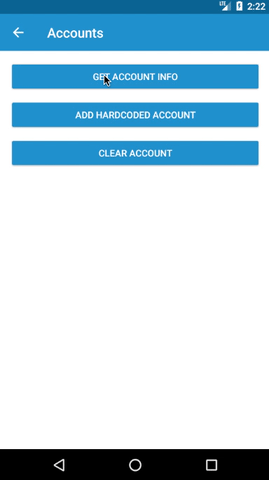

# adal-accounts
Android library that helps store and retrieve an Account from Android [AccountManager](https://developer.android.com/reference/android/accounts/AccountManager.html).

<div align="center">
  
</div>

### Download
Gradle:

```gradle
dependencies {
  implementation 'com.massivedisaster.adal:adal-accounts:0.1.18'
}
```

### Usage
```java
public class FragmentAccounts extends BaseFragment {

    @Override
    protected void doOnCreated() {
        AccountHelper.initialize(getActivity());

        getAccount();
        addAccount();
        clearAccount();        
    }

    private void clearAccount() {
        AccountHelper.clearAccounts(getContext(), new AccountHelper.OnAccountListener() {
          @Override
          public void onFinished() {
          }
        });
    }

    private void addAccount() {
        AccountHelper.addAccount(getContext(), "hardcoded_name", "hardcoded_password", "hardcoded_token");
    }

    private void getAccount() {
         Account account = AccountHelper.getCurrentAccount(getContext());
        if (account != null) {
            Toast.makeText(getContext(), "Name: " + account.name + " \nPassword: " + AccountHelper.getAccountPassword(account) + " \ntoken: " + AccountHelper.getCurrentToken(account, getContext()), Toast.LENGTH_LONG).show();
        } else {
            Toast.makeText(getContext(), "No account available" , Toast.LENGTH_LONG).show();
        }
    }
}
```
### Contributing
[CONTRIBUTING](../CONTRIBUTING.md)

### License
[MIT LICENSE](../LICENSE.md)