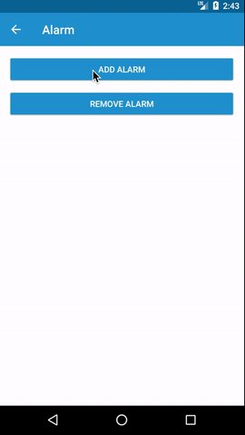

# adal-alarm
Android library to add, remove alarms and verify if an alarm exist!

<div align="center">
  
</div>

### Download

Gradle:

```gradle
dependencies {
  implementation 'com.massivedisaster.adal:adal-alarm:0.1.18'
}
```
### Usage
#### Java
```java
/**
 * Add a new alarm to the system.
 */
private void addAlarm() {
    Calendar calendar = Calendar.getInstance();
    calendar.setTime(new Date());

    if (!AlarmManager.hasAlarm(getContext(), mIntentAlarm, 1001)) {
        AlarmManager.addAlarm(getContext(), mIntentAlarm, 1001, calendar);
        SnackBuilder.show(mBtnRemoveAlarm, "Alarm added!", R.color.colorAccent);
    } else {
        SnackBuilder.show(mBtnAddAlarm, "Alarm already added.", R.color.colorAccent);
    }
}

/**
 * Remove an alarm.
 */
private void removeAlarm() {
    if (AlarmManager.hasAlarm(getContext(), mIntentAlarm, 1001)) {
        AlarmManager.cancelAlarm(getContext(), mIntentAlarm, 1001);
        SnackBuilder.show(mBtnRemoveAlarm, "Alarm removed!", R.color.colorAccent);
    } else {
        SnackBuilder.show(mBtnRemoveAlarm, "Please, add an alarm first!", R.color.colorAccent);
    }
}
```
#### Kotlin
```kotlin
/**
 * Add a new alarm to the system.
 */
private fun addAlarm() {
    val calendar = Calendar.getInstance()
    calendar.time = Date()

    if (!AlarmManager.hasAlarm(context, mIntentAlarm, 1001)) {
        AlarmManager.addAlarm(context, mIntentAlarm, 1001, calendar)
        SnackBuilder.show(mBtnRemoveAlarm, "Alarm added!", R.color.colorAccent)
     } else {
        SnackBuilder.show(mBtnAddAlarm, "Alarm already added.", R.color.colorAccent)
    }
}

/**
 * Remove an alarm.
 */
private fun removeAlarm() {
    if (AlarmManager.hasAlarm(context, mIntentAlarm, 1001)) {
        AlarmManager.cancelAlarm(context, mIntentAlarm, 1001)
        SnackBuilder.show(mBtnRemoveAlarm, "Alarm removed!", R.color.colorAccent)
    } else {
        SnackBuilder.show(mBtnRemoveAlarm, "Please, add an alarm first!", R.color.colorAccent)
    }
}
```

### Contributing
[CONTRIBUTING](../CONTRIBUTING.md)

### License
[MIT LICENSE](../LICENSE.md)
