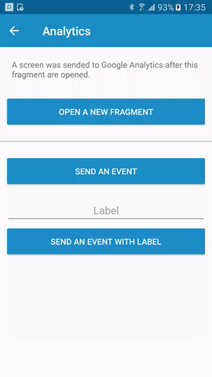
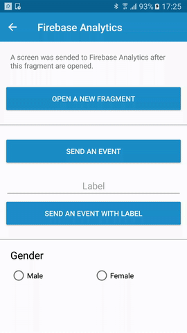

# adal-analytics
Android library that simplifies using Google Analytics or Firebase Analytics.

<div align="center">
  
  
</div>

### Download

Gradle:

```gradle
dependencies {
  implementation 'com.massivedisaster.adal:adal-analytics:0.1.18'
}

// ADD THIS AT THE BOTTOM
apply plugin: 'com.google.gms.google-services'
```
### Usage
#### Java
##### Usage with Google Analytics
```java
public class FragmentAnalytics extends BaseFragment {
    @Override
    protected void doOnCreated() {
      // Send a screen to GA
      AnalyticsManager.with(getContext()).sendScreen("FragmentAnalytics");

      // Send an event to GA
      AnalyticsManager.with(getContext()).sendEvent(
              "Category",
              "Action");
      // Send Enhanced Ecommerce actions to GA
      // Send impression
      Product product = new Product()
          .setId("P12345")
          .setName("Android Warhol T-Shirt")
          .setCategory("Apparel/T-Shirts")
          .setBrand("Google")
          .setVariant("Black")
          .setPosition(1)
          .setCustomDimension(1, "Member");
      AnalyticsManager.with(getContext()).sendImpression(product, "Search Results", "searchResults");
      
      // Send product action (product can be null in this case)
      ProductAction productAction = new ProductAction(ProductAction.ACTION_CLICK)
          .setProductActionList("Search Results");
      AnalyticsManager.with(getContext()).sendProduct(productAction, product, null, "searchResults");
      
      // Send promotion
      Promotion promotion = new Promotion()
          .setId("PROMO_1234")
          .setName("Summer Sale")
          .setCreative("summer_banner2")
          .setPosition("banner_slot1");
      AnalyticsManager.with(getContext()).sendPromotion(promotion, "promotions");
      
      // Send promotion action
      AnalyticsManager.with(getContext()).sendPromotionAction(promotion, Promotion.ACTION_CLICK, "Internal Promotions", "click", "Summer Sale", "promotions");
   }
   ...
}
```
##### Usage with Firebase Analytics
```java
public class FragmentFirebaseAnalytics extends BaseFragment {
    @Override
    protected void doOnCreated() {
      // Send a screen to FA
      FirebaseAnalyticsManager.sendScreen(getActivity(), "FragmentFirebaseAnalytics");

      // Send an event to FA
      Map<String, String> hashMap = new HashMap<>();
      hashMap.put("event_category", "Category");
      hashMap.put("event_action", "Action");
      hashMap.put("event_label", "Label");
      FirebaseAnalyticsManager.sendEvent(getActivity(), "EventName", hashMap);
      
      // Send a user property to FA
      FirebaseAnalyticsManager.sendUserProperty(getActivity(), "Property", "Value");
    }
    ...
}
```

#### Kotlin
##### Usage with Google Analytics
```kotlin
class FragmentAnalytics : BaseFragment() {
    override fun doOnCreated() {
      // Send a screen to GA
      AnalyticsManager.with(context!!).sendScreen("FragmentAnalytics")

        // Send Enhanced Ecommerce actions to GA
        // Send impression
        val product = Product()
                .setId("P12345")
                .setName("Android Warhol T-Shirt")
                .setCategory("Apparel/T-Shirts")
                .setBrand("Google")
                .setVariant("Black")
                .setPosition(1)
                .setCustomDimension(1, "Member")
        AnalyticsManager.with(context!!).sendImpression(product, "Search Results", "searchResults")

        // Send product action (product can be null in this case)
        val productAction = ProductAction(ProductAction.ACTION_CLICK)
                .setProductActionList("Search Results")
        AnalyticsManager.with(context!!).sendProduct(productAction, product, null, "searchResults")

        // Send promotion
        val promotion = Promotion()
                .setId("PROMO_1234")
                .setName("Summer Sale")
                .setCreative("summer_banner2")
                .setPosition("banner_slot1")
        AnalyticsManager.with(context!!).sendPromotion(promotion, "promotions")

        // Send promotion action
        AnalyticsManager.with(context!!).sendPromotionAction(promotion, Promotion.ACTION_CLICK, "Internal Promotions", "click", "Summer Sale", "promotions")
   }
   ...
}
```
##### Usage with Firebase Analytics
```kotlin
class FragmentFirebaseAnalytics : BaseFragment() {
        override fun doOnCreated() {
      // Send a screen to FA
      FirebaseAnalyticsManager.sendScreen(activity, R.string.analytics_screen_main)

      // Send an event to FA
      val hashMap = HashMap<String, String>()
      hashMap.put("event_category", "Category")
      hashMap.put("event_action", "Action")
      hashMap.put("event_label", "Label")
      FirebaseAnalyticsManager.sendEvent(activity, "EventName", hashMap)
      
      // Send a user property to FA
      FirebaseAnalyticsManager.sendUserProperty(activity, "Property", "Value")
    }
    ...
}
```

### Contributing
[CONTRIBUTING](../CONTRIBUTING.md)

### License
[MIT LICENSE](../LICENSE.md)
