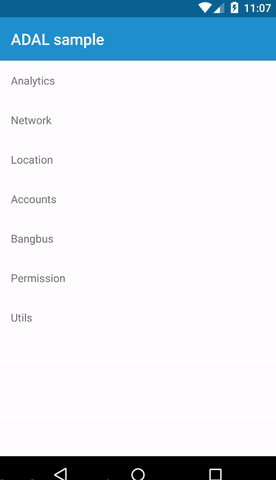

# adal-application-state
Android library that let you know if the application is in foreground or background via `getter` or `callback.` 

<div align="center">
  
</div>

### Download
Gradle:

```gradle
dependencies {
  compile 'com.massivedisaster.adal:adal-application-state:0.1.13'
}
```

### Usage
```java
public class App extends Application implements ApplicationStateManager.BackAndForegroundListener {

    private static final String TAG = App.class.getSimpleName();
    private ApplicationStateManager applicationStateManager;

    @Override
    public void onCreate() {
        super.onCreate();
        applicationStateManager = new ApplicationStateManager(this);
        registerActivityLifecycleCallbacks(applicationStateManager);
    }

    @Override
    public void onBackground() {
        Log.d(TAG, "onBackground");
    }

    @Override
    public void onForeground() {
        Log.d(TAG, "onForeground");
    }

    public boolean isBackground() {
        return applicationStateManager.isBackground();
    }

    public boolean isForeground() {
        return applicationStateManager.isForeground();
    }
}
```

### Contributing
[CONTRIBUTING](../CONTRIBUTING.md)

### License
[MIT LICENSE](../LICENSE.md)