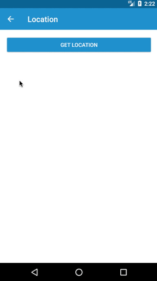

# adal-location
Android library that simplifies obtaining location.

<div align="center">
  
</div>

### Download
Gradle:

```gradle
dependencies {
  compile 'com.massivedisaster.adal:adal-location:0.1.12'
}
```

### Usage
```java
public class FragmentLocation extends BaseFragment {

    private LocationManager mLocationManager;

    @Override
    protected void doOnCreated() {
        getLocation(); 
    }

    @Override
    public void onCreate(@Nullable Bundle savedInstanceState) {
        super.onCreate(savedInstanceState);
        mLocationManager = new LocationManager();
        mLocationManager.onCreate(this);
    }

    @Override
    public void onDestroy() {
        mLocationManager.onDestroy();
        super.onDestroy();
    }

    @Override
    public void onRequestPermissionsResult(int requestCode, @NonNull String[] permissions, @NonNull int[] grantResults) {
        mLocationManager.onRequestPermissionsResult(requestCode, permissions, grantResults);
    }

    @Override
    public void onActivityResult(int requestCode, int resultCode, Intent data) {
        super.onActivityResult(requestCode, resultCode, data);
        mLocationManager.onActivityResult(requestCode, resultCode);
    }

    private void getLocation() {
        mLocationManager.requestSingleLocation(true, new OnLocationManager() {
            @Override
            public void onLocationFound(Location location, boolean isLastKnowLocation) {
              // Use location here.
            }

            @Override
            public void onLocationError(LocationError locationError) {
                switch (locationError) {
                    case DISABLED:
                        // Location disabled.
                        break;
                    case TIMEOUT:
                        // Location timeout.
                        break;
                }
            }

            @Override
            public void onPermissionsDenied() {
                // Permissions denied.
            }

            @Override
            public void onProviderEnabled() {
                // Provider enabled.
            }

            @Override
            public void onProviderDisabled() {
                // Provider disabled.
            }
        });
    }

    private void getLocationUpdates() {
        mLocationManager.requestLocationUpdates(new OnLocationManager() {
            @Override
            public void onLocationFound(Location location, boolean isLastKnowLocation) {
                // Use location here.
            }

            @Override
            public void onLocationError(LocationError locationError) {
                switch (locationError) {
                    case DISABLED:
                        // Location disabled.
                        break;
                    case TIMEOUT:
                        // Location timeout.
                        break;
                }
            }

            @Override
            public void onPermissionsDenied() {
                // Permissions denied.
            }

            @Override
            public void onProviderEnabled() {
                // Provider enabled.
            }

            @Override
            public void onProviderDisabled() {
                // Provider disabled.
            }
        });
    }

    private void stopLocationUpdates() {
        mLocationManager.stopRequestLocation();
    }
}
```

### Contributing
[CONTRIBUTING](../CONTRIBUTING.md)

### License
[MIT LICENSE](../LICENSE.md)
