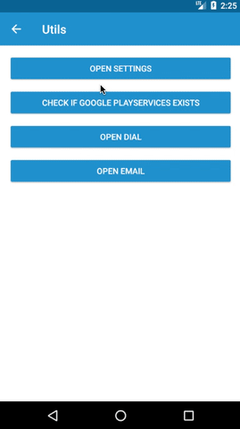

# adal-utils
Android library that includes some useful utils like:
* Open settings;
* Check if Google Play Services exists;
* Open Dial;
* Open Email;

<div align="center">
  
</div>

### Download

Gradle:

```gradle
dependencies {
  implementation 'com.massivedisaster.adal:adal-utils:0.1.20'
}
```
### Usage
```java
// Open settings
AppUtils.openAppSettings(getActivity());

// Check if Google Play Services exists
AppUtils.checkPlayServicesExists(getActivity())

// Open Dial
AppUtils.openDial(getActivity(), "00351910000000");

// Open Email
AppUtils.openEmail(getActivity(), getString(R.string.send_email), "teste@teste.com", "teste2@teste.com");
```

### Contributing
[CONTRIBUTING](../CONTRIBUTING.md)

### License
[MIT LICENSE](../LICENSE.md)